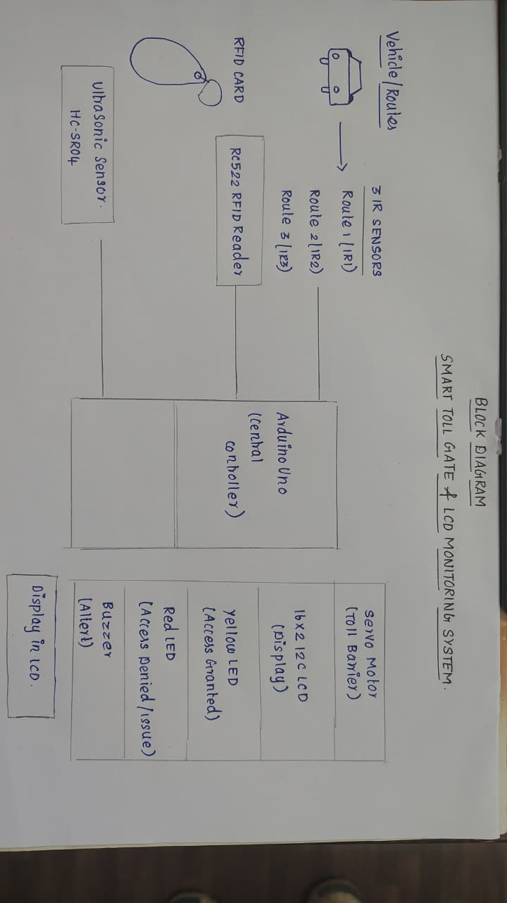
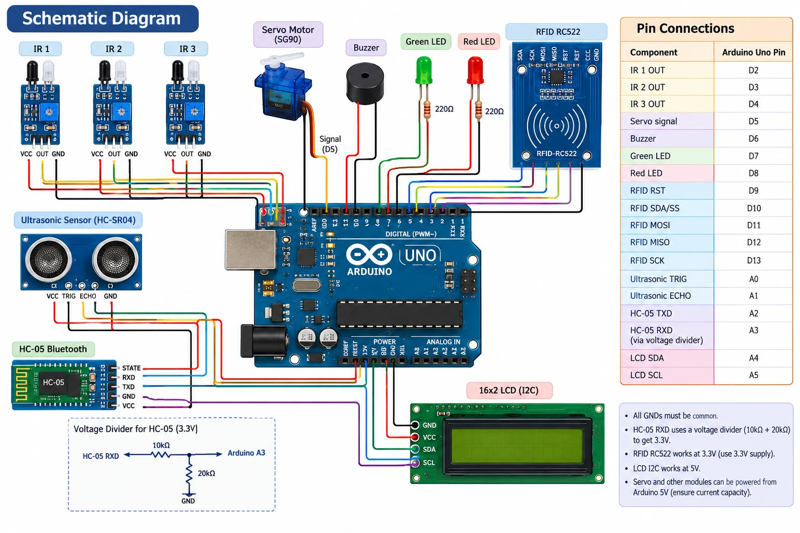

# SMART TOLL GATE 
Smart Toll Gate Monitoring System

Title: Smart Toll Gate Monitoring System

Aim:
To develop an automated toll gate system that detects vehicles, verifies RFID cards, and controls the toll barrier.

Components:

Arduino Uno

RFID RC522 and RFID card/tag

IR sensor

Servo motor

16×2 I2C LCD

Red and Green LEDs

Buzzer

Resistors, breadboard and jumper wires

Procedure:

1. Connect the components to the Arduino.

2. Upload the program and register the authorized RFID card.

3. Detect the vehicle using the IR sensor.

4. Scan the RFID card and verify its ID.

5. Open the gate for authorized access and keep it closed for unauthorized access.

Working:
The IR sensor detects a vehicle and the RFID reader scans its card. Arduino verifies the card ID. For a valid card, the green LED turns ON and the servo opens the gate. For an invalid card, the red LED and buzzer turn ON and the gate remains closed. The LCD displays the current status.

Observation:
The system detects vehicles, identifies RFID cards, controls the barrier automatically, and provides visual and audio alerts.

Result:
The Smart Toll Gate Monitoring System prototype was successfully assembled and demonstrated using Arduino, RFID, IR sensor, and automatic gate control.

## Block diagram

## Schematic diagram

